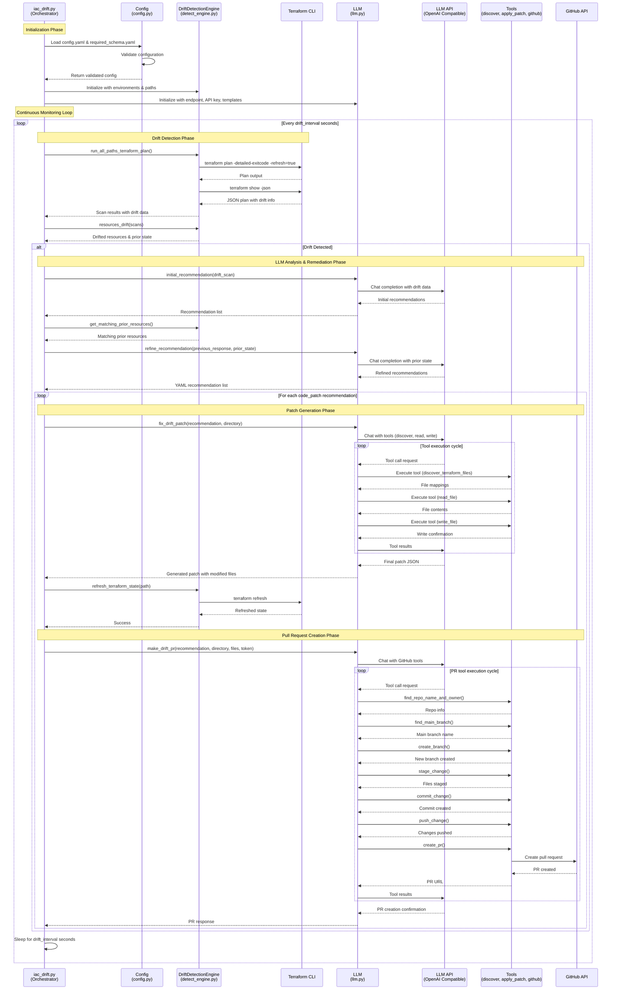

# Overview
OpenSentinel is an open-source LLM-powered agent designed to detect and remediate Infrastructure-as-Code (IaC) drift in Terraform configurations. It leverages a user-defined LLM (configured in `config.yaml`) along with integrated tools to analyze Terraform files, identify drifts, generate patches, and create pull requests for remediation.

# Rationale
Infrastructure drift occurs when the actual state of infrastructure diverges from the declared state in IaC configurations. This can lead to inconsistencies, security vulnerabilities, and operational issues. OpenSentinel aims to automate the detection and remediation of such drifts using advanced language models, reducing manual effort and improving infrastructure reliability.

# Features
- **Configurable**: Easily configurable rules, preferred LLM model, repository to monitor and more via config.yaml
- **Drift Detection**: Analyze Terraform state files to identify configuration drifts between declared and actual(live) infrastructure.
- **Patch Generation**: Discover the locations of drifts in Terraform files and generate patches to remediate the drifts.
- **Pull Request Creation**: Automatically create pull requests with the generated patches for review and merging.
- **Tool Integration**: Integrated with various tools to discover resource maps, read, write to Terraform files as well as perform git operations to create pull requests.
  - **current implemented tools**:
  - discover_Terraform_files
  - read_file
  - write_file
  - find_repo_name_and_owner
  - list_drifted_prs
  - find_main_branch
  - create_branch
  - stage_change
  - commit_change
  - push_change
  - create_pr
  - delete_branch


# Warning
This is a active project and is under heavy development.

This project is currently a proof-of-concept to understand the capabilities of LLMs in the context of Infrastructure-as-Code drift detection and remediation. As it stands, it is not production-ready and should not
be used in production environments.

There are many changes need to be made before this can be considered production-ready which will be defined
in the research paper.

# Architecture Design
The architecture of OpenSentinel consists of the following key components:
1. **Detect Engine**: This is responsible for interacting with the Terraform state files and commands to get the
   `resource_drifts` resources, `prior_state` resources and other relevant information needed for drift detection.
   This component is capable of refreshing the Terraform state after the drift has been patched and more.
2. **LLM**: This component is responsible for interacting with the LLM model via the API. This component obtains the initial recommendations, perform a second pass recommendation to reduce hallucinations, provide tool calling capacities to patch the drifts, and create pull requests.
3. **iac_drift.py**: This is the main orchestrator that ties all the components together. It manages the continuous monitoring of the repositories, invokes the drift detection engine, interacts with the LLM for patch generation and pull request creation.

## High-Level Component Interaction Diagram



# Prequisites
 - A running LLM model. This is designed with privacy in mind, so you can run self hosted model such as ollama. However, the project utilize OpenAI's python's SDK so you are able to use any LLM models either self-hosted or commercial as long as they are compatible with OpenAI's python SDK.
 - Python 3+
 - Git installed and configured
 - Terraform installed and configured

# Getting Started
1. Clone the repository:
   ```bash
   git clone https://github.com/kemoycampbell/open-iac-sentinel-llm
   ```
2. Create a virtual environment and install dependencies:
   ```bash
   python -m venv venv
   source venv/bin/activate  # On Windows use `venv\Scripts\activate`
   pip install -r requirements.txt
   ```
3. Configure the application by creating `config.yaml`
   ```bash
   cp config.example.yaml config.yaml
   ```
4. Create and configure .env file with your LLM API keys and other sensitive information.
   ```bash
    cp env.example .env
    ```

4. Update `config.yaml` with your settings. You should specify:
   - LLM model and API key
   - List of repositories to monitor
     - infrastructure type such as production, staging, development, you can come up with any naming
     - paths to Terraform directories
     - list of resources to include or exclude from monitoring
   - Drift detection interval
  
  5. Run the application:
    ```bash
    cd src
    python iac_drift.py
    ```

# TODO
- [ ] Convert to threaded or asynchronous processing for monitoring multiple repositories concurrently.
- [ ] Implement logging and monitoring for better observability.
- [ ] Allow configurations of templates. This will allow user to bring in their own prompt templates
- [ ] Implement more robust error handling and retry mechanisms.
- [ ] Add support for more version control systems like GitLab, Bitbucket, etc.
- [ ] Refactor codebase for better modularity and maintainability.
- [ ] Implement unit and integration tests.
- [ ] Experiment with different approaches compare to purely prompt templated based
  
# License
This project is licensed under the MIT License - see the LICENSE file for details.

# Contributions
Contributions are welcome! Please open issues and submit pull requests for any features, bug fixes,
or improvements.


  